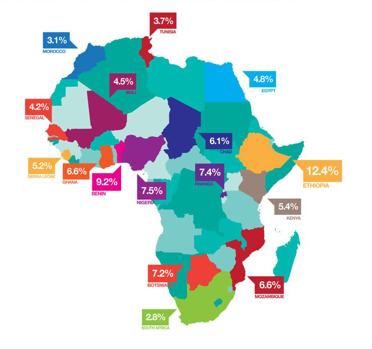

# Welcome to RocketDevs

## About RocketDevs

RocketDevs is a non-profit organization dedicated to bridging the gap between talented software developers in Africa and startups worldwide seeking to harness the potential of diverse technological talent. At RocketDevs, we believe in creating opportunities where they are most needed, helping to spotlight and elevate the exceptional skills of African developers often overlooked in the global tech scene.

### Our Mission

Our mission is to provide a platform that not only connects African developers with global tech startups but also supports the growth and development of these talents. By offering our services at no cost, we aim to foster an inclusive, equitable tech ecosystem where talent alone determines opportunities.

### Vision

Our vision is a tech industry that values diversity and recognizes the innovative potential of developers from all backgrounds, including those from underrepresented regions such as Africa.

## Why RocketDevs?

### The Challenge

African software developers often face significant barriers to employment in the global tech market, including:

- **Visibility:** Despite high levels of skill and competence, African developers frequently lack the visibility and access to opportunities that developers in more prominent tech hubs enjoy.
- **Access to Opportunities:** Limited job opportunities in local markets compel developers to seek employment internationally, where they often encounter biases and misconceptions about their skills and capabilities.
- **Networking Challenges:** Developers in Africa typically have fewer opportunities to network with international tech companies and startups.

### Our Solution

RocketDevs addresses these challenges by:

- **Creating Visibility:** Showcasing the top talent available in Africa through a comprehensive, easy-to-navigate platform.
- **Providing Free Access:** Allowing startups to sign up, browse, and interview developers at no cost, removing financial barriers that might deter small startups or individuals from exploring this rich talent pool.
- **Cultivating Equal Opportunities:** By emphasizing talent and skill over location and background, RocketDevs ensures that every developer gets a fair chance to prove their capabilities.

## Services Offered

### For Startups

- **Free Registration:** Startups can register on the RocketDevs platform at no cost.
- **Talent Search:** Access a diverse pool of software developers from across Africa, each vetted for their skills and expertise.
- **Interview Scheduling:** Use our platform to schedule interviews and find the perfect match for your development needs without any fee.

### For Developers

- **Showcase Your Skills:** Join RocketDevs to get listed on a platform that is visited by startups from around the world.
- **Professional Growth:** Receive opportunities for interviews and placements that can lead to career growth and exposure to international markets.
- **Networking:** Connect with other developers and companies to expand your professional network.

## Getting Started

### For Startups

1. **Sign Up:** Register your company on the RocketDevs platform.
2. **Browse Profiles:** Look through our database of developers to find potential matches.
3. **Interview Developers:** Schedule interviews directly through our platform.

### For Developers

1. **Sign Up:** Complete your profile to join our network of developers.
2. **Get Discovered:** Your profile will be visible to startups looking for your skills.
3. **Interview Opportunities:** Receive and respond to interview requests from startups.

## Support

For support, visit our help center or contact our support team at [support@mail.rocketdevs.com](mailto:support@rocketdevs.org). We are here to assist you every step of the way!

## Join Us

Whether you are a startup looking to innovate with diverse talent, or a developer in Africa aspiring to global opportunities, RocketDevs is your platform. Let's build a more inclusive tech world together!
