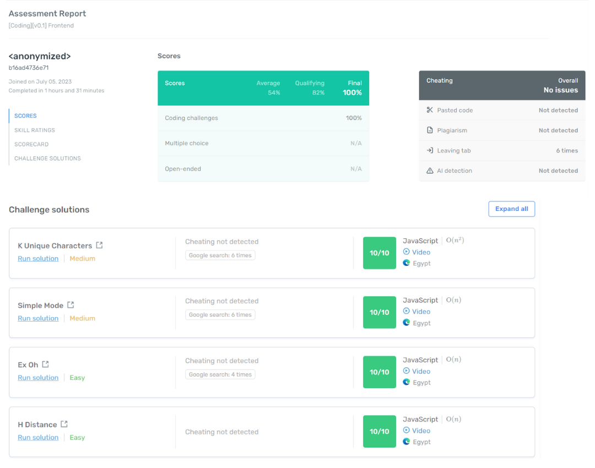

# Why RocketDevs?

### **Unparalleled Cost/Impact**

As a bootstrapped startup, we understand the importance of cost-effectiveness without compromising on competence. While our competitors charge around $54 and $78 per average developer, RocketDevs offers an incredible pricing model. We charge only 15$ for the same high-caliber developer talent. This means significant savings for your company while still securing exceptional remote developers who meet your specific requirements.

We are bootstrapped and profitable from Day 1. Unlike our competitors, we don't have a 87M Series D debt note and series debt note and never will. Our 90% margin is your 90% savings.

### **Rigorous 10-Hour Screening Process**
At RocketDevs, talent screening is our bread and butter. [Our comprehensive and meticulous 10-hour screening process](TechnicalScreeningProcess.md) ensures that only the most competent developers make it through. We assess their technical skills, problem-solving abilities, and overall suitability for remote work. By investing significant time and effort in screening, we deliver developers who are not only highly skilled but also possess the right mindset and work ethic to thrive in a remote environment.

### **Watch the screenings as if you were there**

[We provide a fully comprehensive view and access to the assessment results](https://youtu.be/4nUcmkj0yfQ?si=vcsY4awOGdScnPbA&t=69), giving you complete transparency in the evaluation process. Our assessment platform captures detailed information, including multiple-choice assessments, skill-based assessments focusing on individual strengths, and even live video recordings of algorithims and system design. This comprehensive view allows you to gain deep insights into the candidates' performance, helping you make informed decisions based on objective data.

By leveraging our advanced assessment tools, you can have confidence in the developers you select from RocketDevs. You can review their technical proficiency, problem-solving approaches, and how they handle real-time challenges during the assessment process. This comprehensive evaluation empowers you to align your hiring decisions with your specific project requirements and organizational goals.

Our commitment to providing you with a holistic view of the assessment results underscores our dedication to quality and transparency. With RocketDevs, you can be assured that the developers you choose have undergone rigorous evaluation, ensuring that you have access to top talent that is both technically competent and well-suited for remote work environments.

### **Make Every Second Count**

RocketDevs ships with real-time monitoring and detailed reports designed to empower managers to make data-driven decisions about resource allocation and project priorities. This level of visibility not only promotes transparency but also bolsters accountability among remote workers, ensuring they remain on track and aligned with organizational goals.

[Fully integrated](https://www.youtube.com/watch?v=4nUcmkj0yfQ&t=89s) with the tools you use: JIRA, Trello, GitHub, G-suite, Zoom, and way more.

### **Risk-Free Trial Period**
Take advantage of the two week trial offered by RocketDevs. During this period, you can work with the developer to assess their skills and determine their compatibility with your project requirements. This risk-free trial allows you to make an informed decision before committing further.

 

    <button type="button" class="md-button md-button--primary" onclick="window.location.href = 'https://rocketdevs.com/browse';"> Browse Developers</button>

