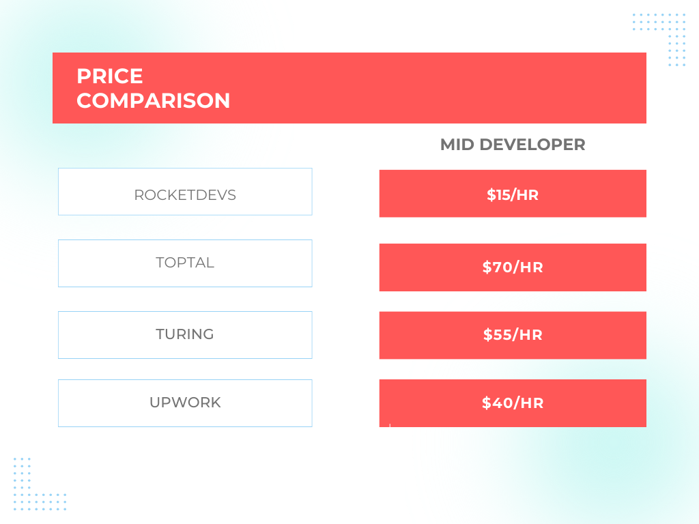
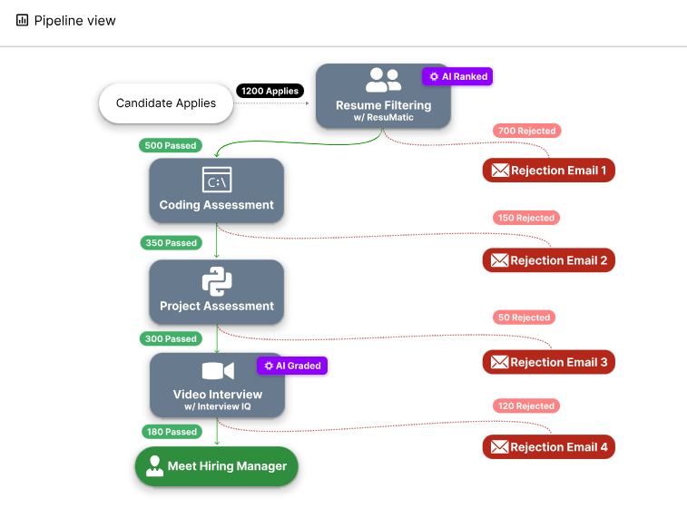
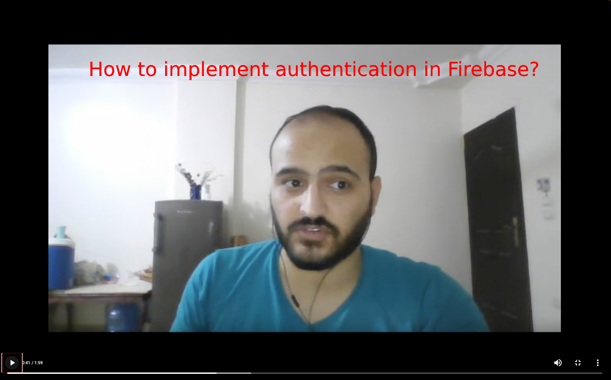
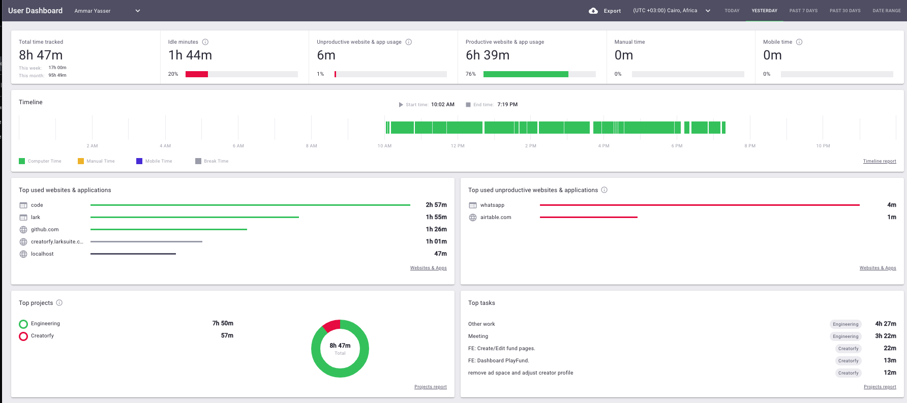

# Why RocketDevs?

At RocketDevs, we are on a mission to bring job opportunities to emerging countries. Our unique approach combines unparalleled value, rigorous screening, and productivity management to deliver top-notch performance at unbeatable value. All while bringing opportunity to regions where it is needed most.

### **Unparalleled Cost/Impact**

As a bootstrapped startup, we understand the importance of cost-effectiveness without compromising on competence. While our competitors charge $8,640/month and $12,480/month per median-priced developer, RocketDevs offers an incredible pricing model. We charge only $1600/month for the same high-caliber developer talent. We accomplish this by This means significant savings for your company while still securing exceptional remote developers who meet your specific requirements.

Another point of pride: We are bootstrapped and profitable from Day 1. Unlike our competitors, we don't have a 87M Series D debt note and never will. Our 90% margin is your 90% savings.

### **Feel good about it: The Humanitarian Power of our Mission**

As a team in Africa, we believe that Africa's software development landscape is brimming with untapped potential, driven by the increasing availability of free education and improved infrastructure. With a youthful and rapidly expanding population, the continent stands as a unique opportunity for substantial economic growth and advancement.

Where needed, RocketDevs will supply equipment to ensure access to the internet and computing resources. By doing so we aim to foster economic progress and drive a significant humanitarian impact. These jobs not only offer financial stability but also empower individuals to lead better lives, access quality education, and actively contribute to their communities.

### **Rigorous 8-Hour Screening Process**

At RocketDevs, talent screening is our bread and butter. [Our comprehensive and meticulous 8-hour screening process](TechnicalScreeningProcess.md) ensures that only the most competent developers make it through. We assess their technical skills, problem-solving abilities, and overall suitability for remote work. By investing significant time and effort in screening, we deliver developers who are not only highly skilled but also possess the right mindset and work ethic to thrive in a remote environment.

### **Watch the screenings as if you were there**

Every developer must successfully complete a minimum of 8 hours of interviews. [We provide a fully comprehensive view and access to the assessment results of the top candidates](https://youtu.be/4nUcmkj0yfQ?si=vcsY4awOGdScnPbA&t=69), giving you complete transparency in the evaluation process. Our assessment platform captures detailed information, including multiple-choice assessments, skill-based assessments focusing on individual strengths, and even live video recordings of algorithims and system design. This comprehensive view allows you to gain deep insights into the candidates' performance, helping you make informed decisions based on objective data.

By leveraging our advanced assessment tools, you can have confidence in the developers you select from RocketDevs. You can review their technical proficiency, problem-solving approaches, and how they handle real-time challenges during the assessment process. This comprehensive evaluation empowers you to align your hiring decisions with your specific project requirements and organizational goals.

### **Make Every Second Count**

RocketDevs ships with [real-time monitoring and detailed reports](https://www.youtube.com/watch?v=4nUcmkj0yfQ&t=89s) designed to empower managers to make data-driven decisions about resource allocation and project priorities. This level of visibility not only promotes transparency but also bolsters accountability among remote workers, ensuring they remain on track and aligned with organizational goals.

Fully integrated ith the tools you use: JIRA, Trello, GitHub, G-suite, Zoom, and way more.

### **Risk-Free Trial Period**
Take advantage of the two-week trial offered by RocketDevs. During this period, you can work with the developer to assess their skills and determine their compatibility with your project requirements. This risk-free trial allows you to make an informed decision before committing further.

 

<iframe width="560" height="315" src="https://www.youtube.com/embed/4nUcmkj0yfQ?si=9XNd9B9EZSoZFBg_" title="YouTube video player" frameborder="0" allow="accelerometer; autoplay; clipboard-write; encrypted-media; gyroscope; picture-in-picture; web-share" allowfullscreen></iframe>

 

    <button type="button" class="md-button md-button--primary" onclick="window.location.href = 'https://rocketdevs.com/browse';"> Browse Developers</button>

  

<!-- Lark Scheduler Inline Embed End -->